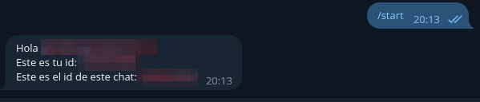

# telegram-id-sender-bot

Este bot te permite conocer tu id de usuario junto con el del chat en el que esté.

## Prerequisitos

* Tener conocimientos de [Docker](https://docs.docker.com/get-started/)
* Tener una cuenta en [Telegram](https://telegram.org/)

## Instalación

#### Crear un bot en telegram y obtener el token

Básicamente, vas a telegram a hablar con [@botfather](https://t.me/botfather) para crear un bot y obtener un token.

Link a la fuente donde la gente de telegram explica cómo hacerlo: [https://core.telegram.org/bots#how-do-i-create-a-bot](https://core.telegram.org/bots#how-do-i-create-a-bot)

Este token lo vamos a usar dentro del docker-compose para pasarselo como variable al main.py.

#### Clonar el proyecto

```bash
git clone https://github.com/nothingbutlucas/telegram-id-sender-bot
cd telegram-id-sender-bot
```

#### Buildear la imagen (Opcional)

Este paso es opcional, porque la imagen ya la *buildee* y subí a [dockerhub](https://hub.docker.com/r/nothingbutlucas/telegram-id-sender-bot)

```bash
docker build -t telegram-id-sender-bot .
```

#### Configurar el docker-compose

Editas el docker-compose para poner el token de tu bot en donde está la variable TOKEN:

```yaml
version: "3.9"
services:
  app:
    image: nothingbutlucas/telegram-id-sender-bot:1.0
    environment:
      TOKEN: "ACA-VA-EL-TOKEN-QUE-TE-DIO-@BOTFATHER" # Token del bot
    command: ["python3", "-u", "main.py"]
```

#### Iniciar el contenedor

```bash
docker-compose up -d
```

## Uso

Vas a telegram, le hablas al bot que creaste y cuando apretes /start o le mandes /start te va a devolver la data.
Funciona igual en un grupo.




## Desinstalación

Si ya obtuviste la data que necesitabas y no lo vas a volver a usar, baja el contenedor, eliminá la imagen y también podes borrar la carpeta del proyecto

```bash
docker-compose down --rmi all && rm -rf "telegram-id-sender-bot"
```
